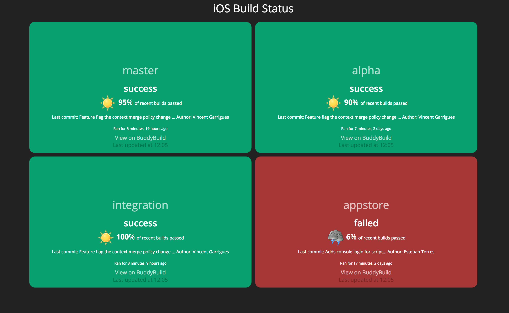

<p align="center">
  
</p>

[](https://travis-ci.org/PiXeL16/buddybuilddashboard)


BuddyBuild Dashboard was build using [Dashing](http://shopify.github.com/dashing) and based on ideas and the work in [build-window](https://github.com/rouanw/build-window). Great to show your most important builds in a TV.

## Example



:rocket: Getting started
-------
Run `bundle install`.

Edit `config/builds.json` with the configuration for your builds:

```
{
  "dashboardTitle": "Your dashboard title",
  "buddyBuildApiBaseUrl": "https://api.buddybuild.com",
  "buddyBuildDashboardBaseUrl": "https://dashboard.buddybuild.com/apps/",

  "buddyBuildAppID": "YOURAPPID",
  "branches": [
    "master",
    "alpha",
    "integration",
    "appstore"
  ]
}
```

Place your BuddyBuild `Auth Token` in a `.env` file at the root of the project.
It should look something like this:

```
BUDDY_BUILD_AUTHORIZATION=Bearer YOURTOKEN
```

Run `dashing start`.

Runs at `http://localhost:3030/builds` by default.

Run `dashing start -d -p 3031` to run it as a daemon and to specify the port. You can stop the daemon with `dashing stop`.

See https://github.com/Shopify/dashing/wiki for more details.

:whale: Docker support
-------
You can spin up a Docker container with the dashboard by running:

`docker-compose up -d`

The application will be ready at `http://localhost:3030` (Linux) or at `http://<DOCKER_HOST_IP>:3030` (Windows/OS X).

You can also build the image and run a container separately, but [Docker Compose](https://docs.docker.com/compose/install/) makes this process much simpler.

:100: Contributing
-----
Pull requests are very welcome. Run the tests with `rspec`.

:alien: Author
------
Chris Jimenez - http://code.chrisjimenez.net

:beer: Donate
------
If you want to buy me a beer, you can donate to my coin addresses below:
#### BTC
1BeGBew4CBdLgUSmvoyiU1LrM99GpkXgkj
#### ETH
0xa59a3793E3Cb5f3B1AdE6887783D225EDf67192d
#### LTC
Ld6FB3Tqjf6B8iz9Gn9sMr7BnowAjSUXaV

## License
`BuddyBuild Dashboard` is released under the MIT license. See [LICENSE](https://github.com/pixel16/buddybuilddashboard/blob/master/LICENSE) for details.